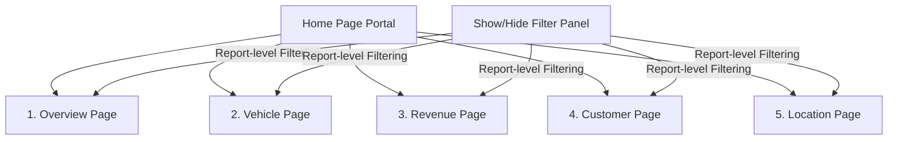
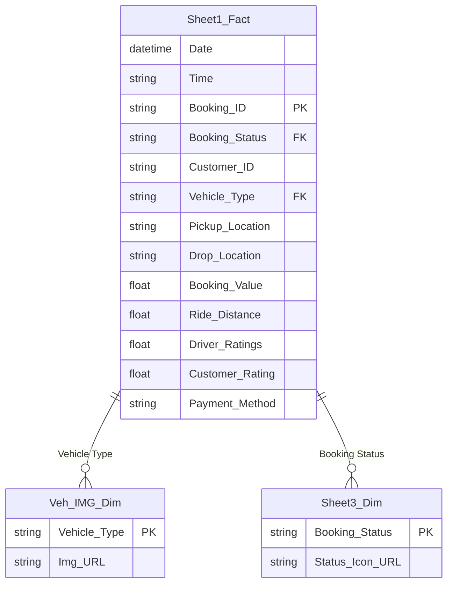

# 🚖 Uber BI Analytics Project: Interactive Operational & Revenue Dashboard

[](https://powerbi.microsoft.com/)
[](./Dataset/uber.xlsx)
[](./Uber.pbix)
[](./Dataset/uber.xlsx)

Welcome to the **Uber BI Analytics Project**! This repository hosts a comprehensive, production-grade Power BI dashboard built to analyze, monitor, and optimize Uber's ride-booking operations, financial performance, customer behaviors, driver ratings, and geographical trends. 

Powered by a robust dataset of **150,000 bookings** spanning the year 2025, this interactive report empowers operational managers and business analysts to uncover operational bottlenecks, maximize ride completion rates, investigate cancellations, and optimize revenue streams.


---

## 📌 Table of Contents
1. [📊 Dashboard Architecture & Page-by-Page Breakdown](#-dashboard-architecture--page-by-page-breakdown)
2. [📁 Dataset Profile & Database Schema](#-dataset-profile--database-schema)
3. [🔍 Advanced Data Profile & Key Statistics](#-advanced-data-profile--key-statistics)
4. [💡 Strategic Business Insights & Recommendations](#-strategic-business-insights--recommendations)
5. [🛠️ Data Modeling & Technical Execution](#%EF%B8%8F-data-modeling--technical-execution)
6. [🚀 How to Run & Interact with the Report](#-how-to-run--interact-with-the-report)

---

## 📊 Dashboard Architecture & Page-by-Page Breakdown

The project contains a highly interactive **6-page dashboard** (`Uber.pbix`) configured with custom page navigation, advanced slicers, custom SVG icons, and a sliding filter panel.



### Page 1: Home (Portal)
* **Purpose**: Serves as the landing hub of the report, establishing the premium branding and providing a central navigation gateway.
* **Visual Elements Count**: 3
* **Key Components**:
  * `pageNavigator`: A customized navigation bar to switch between the 5 analytics sheets.
  * `image`: Brand logos and background layouts.

### Page 2: Overview (Executive Summary)
* **Purpose**: Provides operational and financial executive-level insights at a glance.
* **Visual Elements Count**: 46
* **Key Components**:
  * **Core KPIs**: 11 `cardVisual` elements for crucial metrics:
    1. *Completed Bookings*
    2. *Lost Bookings*
    3. *Total Revenue*
    4. *Total Distance Covered*
    5. *Average Ride Distance*
    6. *Average Rider Rating*
    7. *Average Driver Rating*
  * **Monthly & Quarterly Trends**: `areaChart` and `clusteredColumnChart` tracking ride volume and revenue across months and quarters.
  * **Revenue by Vehicle Type**: Visualizing revenue contributions by ride categories.
  * **Top Pickup & Drop Locations**: Horizontal bar charts displaying the most high-traffic routes.

### Page 3: Vehicle Performance
* **Purpose**: Analyzes vehicle utilization, demand distribution, and fleet-specific revenue generation.
* **Visual Elements Count**: 26
* **Key Components**:
  * **Vehicle Contribution Matrix**: Detailed `tableEx` showing Booking Count, Revenue, and percentage Contribution of each vehicle category.
  * **KPI Cards**: 7 cards displaying vehicle-specific metrics.
  * **Trend lines**: `lineChart` showing demand fluctuations across time.

### Page 4: Revenue & Financials
* **Purpose**: Decouples the revenue streams to understand monetization channels, payment types, and high-value customer categories.
* **Visual Elements Count**: 34
* **Key Components**:
  * **Monetization Demographics**: Revenue breakdown by Customer profiles, Payment Methods (UPI, Cash, Wallet, Card), and Vehicle classes.
  * **Temporal Flow**: Monthly and quarterly financial trends (`areaChart` and `clusteredBarChart`).
  * **KPI Cards**: 9 cards tracking gross margins, payment transaction distribution, and booking values.

### Page 5: Customer & Rider Experience (Rider Page)
* **Purpose**: Explores ride cancellation patterns, retention classes, and user feedback.
* **Visual Elements Count**: 38
* **Key Components**:
  * **Cancellation Root Cause Analysis**: Visualizing cancellations by customer reason and driver reason.
  * **Rider Segmentation**: Cohorts detailing *First Riders*, *Return Riders*, and *Regular Riders*.
  * **Detailed Transaction Grid**: Tabular view of detailed customer records with feedback scores and status mappings.

### Page 6: Location & Spatial Analytics
* **Purpose**: Pinpoints demand hotspots, travel distances, and operational high-congestion periods.
* **Visual Elements Count**: 31
* **Key Components**:
  * **Temporal Peaks**: Matrix showing busiest hours/time slots and demand waves.
  * **Spatial Dynamics**: Busy pickup/drop locations and total distances traveled by vehicle types.
  * **KPI Cards**: 8 cards indicating peak distances and busiest sectors.

---

## 📁 Dataset Profile & Database Schema

The analytics model ingest a massive historical transaction dataset located in [uber.xlsx](./Dataset/uber.xlsx) containing **150,000 records** spanning 2025.

### Main Transactions Table (`Sheet1`)
| # | Column Name | Data Type | Null Count | Unique Count | Business Context / Description |
|---|---|---|---|---|---|
| 1 | `Date` | Datetime | 0 | 364 days | The date the booking request was initiated. |
| 2 | `Time` | String / Object | 0 | 62,910 | The precise timestamp of the booking request. |
| 3 | `Booking ID` | String | 0 | 150,000 | A unique, non-null identifier for each booking. |
| 4 | `Booking Status` | String | 0 | 5 | Current status: *Completed, Cancelled by Driver, Cancelled by Customer, No Driver Found, Incomplete*. |
| 5 | `Customer ID` | String | 0 | 98,754 | A unique identifier for the registered customer. |
| 6 | `Vehicle Type` | String | 0 | 7 | Category of ride: *Auto, Go Mini, Go Sedan, Bike, Premier Sedan, eBike, Uber XL*. |
| 7 | `Pickup Location` | String | 0 | 176 | The standard starting terminal/area of the ride. |
| 8 | `Drop Location` | String | 0 | 176 | The designated destination terminal/area of the ride. |
| 9 | `Cancelled Rides by Customer` | Float | 139,500 | 2 | Value flag `1.0` if cancelled by the customer, else empty. |
| 10 | `Reason for cancelling by Customer`| String | 139,500 | 5 | Stated reason (e.g., *Wrong Address, Change of plans, Driver asked to cancel*). |
| 11 | `Cancelled Rides by Driver` | Float | 123,000 | 2 | Value flag `1.0` if cancelled by the driver, else empty. |
| 12 | `Driver Cancellation Reason` | String | 123,000 | 4 | Stated reason (e.g., *Customer related issue, Personal & Car related issues*). |
| 13 | `Incomplete Rides` | Float | 141,000 | 2 | Value flag `1.0` if the ride started but was aborted. |
| 14 | `Incomplete Rides Reason` | String | 141,000 | 3 | Stated reason (e.g., *Vehicle Breakdown, Customer Demand*). |
| 15 | `Booking Value` | Float | 48,000 | - | Total fare charge for completed/invoiced rides. |
| 16 | `Ride Distance` | Float | 48,000 | - | Standard distance covered in kilometers (or miles). |
| 17 | `Driver Ratings` | Float | 57,000 | 5 (3.0 - 5.0) | Customer rating for the driver (scale of 3.0 to 5.0). |
| 18 | `Customer Rating` | Float | 57,000 | 5 (3.0 - 5.0) | Driver rating for the customer (scale of 3.0 to 5.0). |
| 19 | `Payment Method` | String | 48,000 | 5 | Settlement method: *UPI, Cash, Uber Wallet, Credit Card, Debit Card*. |

---

## 🔍 Advanced Data Profile & Key Statistics

Our programmatic data-profiling phase uncovered deep mathematical splits in the transactions:

### 1. Booking Status Distribution
Of the 150,000 ride requests generated:
* **Completed Rides**: **93,000** (62.0%) — *Successfully executed, generating full revenue.*
* **Cancelled by Driver**: **27,000** (18.0%) — *Represents the largest operational dropoff.*
* **Cancelled by Customer**: **10,500** (7.0%) — *Minor passenger-side cancellations.*
* **No Driver Found**: **10,500** (7.0%) — *Fulfillment gaps where supply failed to meet demand.*
* **Incomplete Rides**: **9,000** (6.0%) — *Rides initiated but aborted mid-trip.*

> [!NOTE]
> The **48,000** incomplete/cancelled requests (Cancelled by Driver + Cancelled by Customer + No Driver Found) exactly match the missing value counts in `Booking Value`, `Ride Distance`, and `Payment Method`. This confirms that only completed or active/incomplete rides generated financial transactions.

```
Total Bookings: 150,000
 ├── Completed: 93,000 (62.0%) [Generated Revenue]
 ├── Cancelled by Driver: 27,000 (18.0%) [Lost Opportunity]
 ├── Cancelled by Customer: 10,500 (7.0%) [Passenger Dropoff]
 ├── No Driver Found: 10,500 (7.0%) [Supply Constrained]
 └── Incomplete: 9,000 (6.0%) [Mid-Trip Aborted]
```

### 2. Fleet Demographics & Vehicle Popularity
Operational vehicle split across all 150,000 records:
* **Auto (3 Wheeler)**: **37,419** bookings (24.9%) — *Most popular ride, offering affordability.*
* **Go Mini (Hatchback)**: **29,806** bookings (19.9%) — *Standard budget option.*
* **Go Sedan**: **27,141** bookings (18.1%) — *Preferred option for daily commutes.*
* **Bike (Moto)**: **22,517** bookings (15.0%) — *First-choice option for high-traffic peak hours.*
* **Premier Sedan (Comfort)**: **18,111** bookings (12.1%) — *Premium-tier service.*
* **eBike**: **10,557** bookings (7.0%) — *Eco-friendly urban option.*
* **Uber XL (SUV)**: **4,449** bookings (3.0%) — *High-capacity family/group transit.*

### 3. Financial Settlements (Payment Methods)
Settlement distribution for the 102,000 generated transactions (Completed + Incomplete rides):
* **UPI (Mobile Payment)**: **45,909** (45.0%) — *Dominates transaction volume, reflecting high digital payment adoption.*
* **Cash**: **25,367** (24.9%) — *Remains an essential payment mode in local operations.*
* **Uber Wallet**: **12,276** (12.0%) — *Decent closed-loop payment engagement.*
* **Credit Card**: **10,209** (10.0%) — *Preferred by premium sedan users.*
* **Debit Card**: **8,239** (8.1%) — *Card-based settlements.*

### 4. Cancellation Reason Deep-Dive
Understanding why ride bookings collapse:
* **Passenger Cancellations** (10,500 total):
  1. *Wrong Address entered*: **2,362** (22.5%) — *Points to map pin inaccuracies.*
  2. *Change of plans*: **2,353** (22.4%) — *Passenger-side whim.*
  3. *Driver is not moving towards pickup*: **2,335** (22.2%) — *Potential driver multi-apping or navigation confusion.*
  4. *Driver asked to cancel*: **2,295** (21.9%) — *Driver dodging low-incentive routes.*
  5. *AC is not working*: **1,155** (11.0%) — *Comfort expectation mismatch (mainly in sedans).*

* **Driver Cancellations** (27,000 total):
  1. *Customer related issue*: **6,837** (25.3%)
  2. *The customer was coughing/sick*: **6,751** (25.0%) — *Health/safety concern.*
  3. *Personal & Car related issues*: **6,726** (24.9%)
  4. *More than permitted people in vehicle*: **6,686** (24.8%) — *Passenger overloading.*

* **Incomplete Rides** (9,000 total):
  1. *Customer Demand*: **3,040** (33.8%) — *Customer requested early dropoff.*
  2. *Vehicle Breakdown*: **3,012** (33.5%) — *Maintenance/Fleet reliability issue.*
  3. *Other Issue*: **2,948** (32.7%)

---

## 💡 Strategic Business Insights & Recommendations

Based on the quantitative data analysis and visual highlights of the dashboard, we propose several high-impact recommendations to improve ride completion and revenue:

> [!TIP]
> ### 1. Implement Driver Booking Completion Incentives
> **Problem**: **18%** of total ride bookings (27,000) are cancelled by drivers. Over **2,200** customer cancellations were caused because the *driver asked the customer to cancel*.
> **Recommendation**: Introduce progressive completion incentives. Penalize high cancellation rates during peak times, and reward drivers who maintain high completion metrics (especially on shorter trips).
> 
> ### 2. Tackle Fleet Vehicle Breakdowns
> **Problem**: Out of 9,000 incomplete rides, **3,012** (33.5%) failed mid-trip due to a *vehicle breakdown*.
> **Recommendation**: Partner with local garages and maintenance fleets. Introduce mandatory seasonal vehicle inspections for drivers, offering discount maintenance vouchers to active drivers to prevent in-ride breakdowns that harm customer loyalty.
> 
> ### 3. Improve Map Pinning & Address UI
> **Problem**: The single largest customer cancellation reason is a **Wrong Address** input (**2,362** occurrences).
> **Recommendation**: Optimize the rider mobile application's landing UI. Implement auto-correcting GPS pin drop confirmations, and require a double-tap verification for pickups in highly crowded locations.
> 
> ### 4. Boost Digital/Wallet Payments
> **Problem**: **UPI** and **Cash** dominate payments (**70%** combined). Credit/Debit cards make up under **18%**. 
> **Recommendation**: Offer seasonal cashbacks or instant discounts for payments completed via Credit Cards or top-up of the **Uber Wallet** (which cuts settlement processing costs and locks customer capital into the system).

---

## 🛠️ Data Modeling & Technical Execution

This project is built using a highly optimized, single-fact relational star schema model to guarantee sub-second visual loading in Power BI:



### 🧮 Core DAX Measures Defined

Below are key DAX formulas implemented to power the KPIs and trends:

* **Booking Completion Rate (%)**:
  ```dax
  Booking Completion Rate = 
  DIVIDE(
      CALCULATE(COUNTROWS('Sheet1'), 'Sheet1'[Booking Status] = "Completed"),
      COUNTROWS('Sheet1'),
      0
  )
  ```

* **Total Revenue**:
  ```dax
  Total Revenue = SUM('Sheet1'[Booking Value])
  ```

* **Total Lost Opportunity (Cancelled Revenue)**:
  ```dax
  Cancelled Bookings Value = 
  CALCULATE(
      COUNTROWS('Sheet1'), 
      'Sheet1'[Booking Status] IN {"Cancelled by Customer", "Cancelled by Driver", "No Driver Found"}
  )
  ```

* **Average Ride Distance**:
  ```dax
  Avg Distance = AVERAGE('Sheet1'[Ride Distance])
  ```

---

## 🚀 How to Run & Interact with the Report

Follow these simple steps to explore the interactive Power BI dashboard on your machine:

### Prerequisites
* **Microsoft Power BI Desktop** (latest version recommended) installed.
* **Microsoft Excel** (to view or modify raw data).

### Steps to Run
1. **Clone/Download the Project**:
   Ensure the directory structure remains intact, containing:
   * `Uber.pbix` (Power BI Report)
   * `Dataset/uber.xlsx` (Source Dataset)
   * `assets/` (Visual assets and background layouts)
2. **Open the Report**:
   Double-click [Uber.pbix](./Uber.pbix) to launch it in Power BI Desktop.
3. **Reconnect the Data Source (If needed)**:
   * If Power BI prompts a "DataSource.Error" due to absolute path differences on your local machine:
     * In Power BI Desktop, click **Transform Data** (Home Tab) -> **Data Source Settings**.
     * Select `uber.xlsx` and click **Change Source**.
     * Browse and point it to your local file path: `d:\Downloads\Dataset-20251215T202657Z-3-001\Dataset\uber.xlsx`.
     * Click **Close & Apply**.
4. **Interact**:
   * Click on the **Show Filter Panel** arrow on the right to toggle filters.
   * Click on the **Home** navigation icons to flip seamlessly between Overview, Vehicle, Revenue, Customer, and Location metrics.
